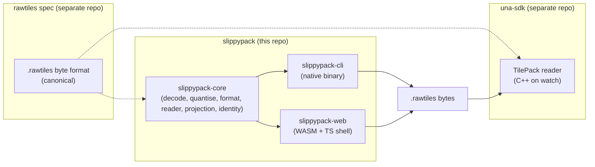
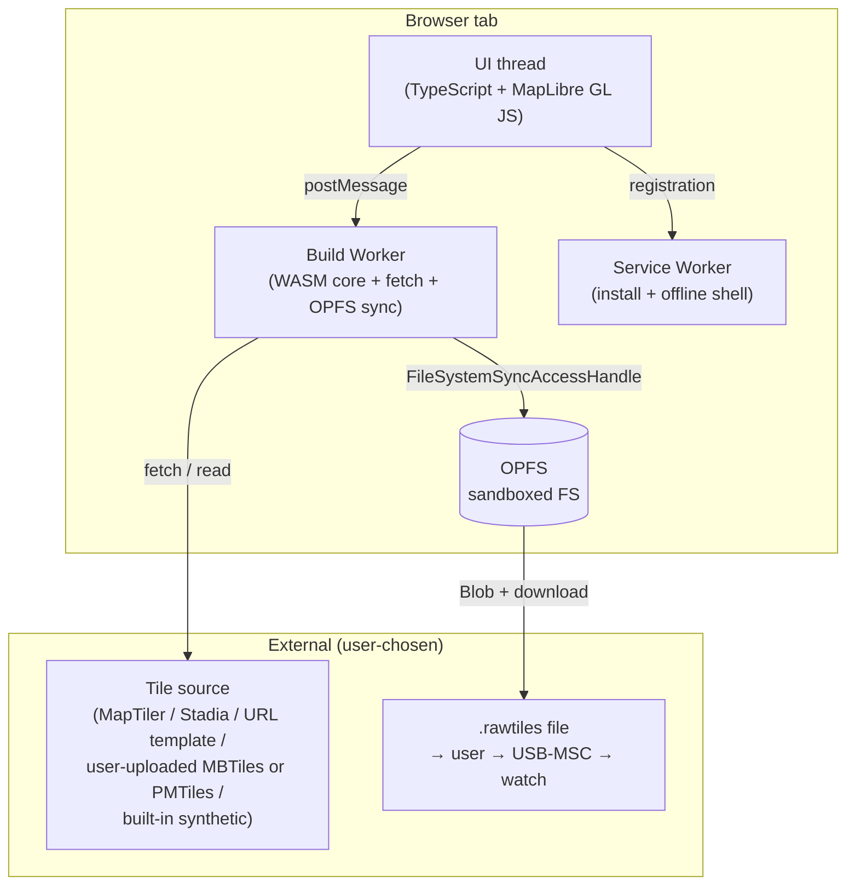

# slippypack — Build offline `.rawtiles` map packs

> Status: **in flight**. Phase 0 (`slippypack-core`: format writer + reader, quantiser, identity, Web Mercator projection) and the first slice of Phase 1 (`slippypack-cli` with `--source synthetic` and URL templates, SIGINT/atomic write) are landed, plus the `slippypack debug uuid` helper from Phase 1.x; subsequent slices ship per [§ Phasing](#phasing). Local Linear projection math is deferred to Phase 10 where it's actually used.

> **The `.rawtiles` byte format is defined by the standalone [rawtiles spec](https://github.com/tobymurray/rawtiles), not by this plan.** This document covers slippypack's design, phasing, and rationale; anything about on-disk bytes (header layout, tile-index entries, extension framing, canonical `pack_uuid` derivation, CRC scope, reader/writer conformance rules) is the spec's authority. Where this plan needs to talk about format details it defers to the spec by section reference; restating spec content here would only create two slightly-different "sources of truth."

## What this is

A Rust toolkit for building offline tile packs in the `.rawtiles` format. One core library, two front-ends:

- **`slippypack` CLI** — a native binary for desktop / CI / power-user workflows. The v1 CLI reads URL templates, `gdal2tiles`-style tile directories, MBTiles, PMTiles, GeoTIFF, OSM PBF (with vector rendering via MapLibre Native, with a `tilemaker`-shellout fallback — see [§ Phase 2](#phase-2--cli-vector-rendering-osm-pbf)), MapLibre style JSON, and a built-in synthetic fixture for first-run validation. Runs entirely offline when sources are local. The canonical tool.
- **`slippypack-web` PWA** — a static browser app for users who can't or won't install a CLI. A strict subset of the CLI: **raster sources only, no in-browser vector rendering, BYO tile source**.

Both write `.rawtiles`. The format itself is defined by the standalone `rawtiles` spec — the public byte contract any conforming reader implements. slippypack is one writer; the una-sdk watch firmware is one reader (others can follow on either side). **The format is the contract** — producers and consumers coordinate only through `.rawtiles` bytes.

The project name picks up "slippy map" — the standard term for `{z}/{x}/{y}` tile schemes (OSM, MapLibre, Mapbox vocabulary). It signals the niche without claiming any particular consumer, device, or rendering style. The `rawtiles` format itself is independent of slippypack: anyone can build a conforming writer or reader from the spec alone.

## Why two front-ends over one Rust core

The CLI serves developers, power users, and the offline-laptop case. The PWA serves the long tail — people who'd otherwise never build a pack at all because installing a CLI is a non-starter for them. Sharing a Rust core means:

- **One implementation of the format writer and the ABGR2222 quantiser.** No drift between CLI and PWA, no per-front-end bug surface.
- **Whole-file byte-identical output for the same inputs.** Both `pack_uuid` (UUIDv5 over the canonical source descriptor — see [§ Canonical source descriptor](#canonical-source-descriptor)) and `build_timestamp` (most-recent source mtime / `Last-Modified`, not build wall-clock) are deterministic functions of inputs. Two builds with identical inputs produce byte-identical `.rawtiles` files across both front-ends and across browsers. CI overrides `--timestamp <unix>` and `--pack-uuid <hex>` exist for reproducibility testing where the "inputs" themselves need to vary; production builds derive both from inputs.
- **The format-as-API claim is real.** Two independent writers (native + WASM) conforming to one spec, plus a C++ reader on the watch side, is the kind of evidence that distinguishes "open" from "marketed as open." Round-trip tests against the watch's reader are the gate.

**The PWA is intentionally a strict subset.** Vector rendering doesn't land in the browser because:

- MapLibre GL JS doesn't expose headless per-tile rendering as a supported API (MapLibre GL JS issues [#239](https://github.com/maplibre/maplibre-gl-js/issues/239) and [#166](https://github.com/maplibre/maplibre-gl-js/issues/166), both open feature requests).
- The CLI's vector-rendering path (Phase 2) covers the use case end-to-end, and a typical workflow will be "CLI renders once, PWA consumes the cached output as MBTiles or PMTiles." Re-rendering in the browser would duplicate work and ship a vector pipeline twice. The CLI's vector path is itself non-trivial (4–6 weeks, see Phase 2); doing it again for the browser is not a marginal cost.
- Custom-style users are already power-user-shaped and reach for the CLI naturally.

What this means concretely: the PWA consumes pre-rendered raster tiles (URL templates, MBTiles, PMTiles, plus the built-in synthetic fixture for first-run validation). The CLI consumes those *plus* OSM PBF (rendered to tiles via `--style <path>` through the vector renderer) and standalone MapLibre style JSON sources (`--source style:///...`, also passed through the renderer). Both renderer paths quantise the rendered tiles before packing. The two front-ends ship at slightly different times against the same core.

## Target environments

**The CLI ships everywhere Rust ships:** macOS, Linux, Windows (x86_64, aarch64). Single statically-linked binary preferred; `cargo install --git https://github.com/<org>/slippypack slippypack-cli` for developers (default features = raster-only; add `--features vector` to pull in the renderer); pre-built binaries via GitHub Releases for end users (vector pre-enabled).

**The PWA targets modern evergreen browsers,** with Chrome / Firefox / Edge as primary targets. Edge cases (Safari quirks, older mobile browsers) get graceful degradation, not design-driving constraints. Specific floors:

- **Chrome / Edge** (Blink) 102+ — OPFS sync access in workers.
- **Firefox** (Gecko) 111+ — OPFS sync access in workers.
- **Safari** (WebKit) — best-effort; current stable supported, older versions out of scope.

Desktop is the primary platform. Mobile works (Android Chrome, iPad/iPhone Safari) within the smaller-pack ceilings that mobile RAM forces. No PWA-install-friction story is worth contorting the design over.

## The three axes this plan optimises

1. **Output fidelity** — `.rawtiles` bytes are bit-identical between CLI and PWA for the same inputs, including the `pack_uuid` (UUIDv5 over the canonical source descriptor) and `build_timestamp` (source-data freshness, not build wall-clock) header fields. Round-trip tests against the watch's reader are the gate.
2. **No backend** — both front-ends are standalone artifacts (binary, static frontend). No project-hosted services means zero operational cost and zero telemetry surface. **BYO tile sources** — users pick where their tiles come from.
3. **Reach** — the CLI runs on every desktop OS; the PWA runs in every evergreen browser. A user with a watch can always build a pack.

These three pull in the same direction: small, fast, offline-friendly tools that anyone can audit and run, with no central infrastructure to trust.

## The load-bearing observation: shared Rust core

The CLI and the PWA are **two front-ends over one Rust library**. `slippypack-core` is a `no_std + alloc` crate (heap allocation required for the format writer's variable-length sections; no OS-level I/O, no thread primitives, no `std::env`) that contains five layered modules with a clean pipeline shape (`source → decoded RGB → optional-quantise → format-write`):

- **`decode`** — PNG / JPEG → RGB888. Pure-Rust decoders (`png`, `jpeg-decoder` via the `image` crate with `default-features = false, features = ["png", "jpeg"]`). The PWA and CLI share this layer.
- **`quantise`** — RGB888 → ABGR2222, integer-only arithmetic for cross-platform determinism. Bypassable (the pipeline composes it; `slippypack-core` does not force it).
- **`format`** — a `TileWriter` trait + the `.rawtiles` implementation (see [§ TileWriter trait](#tilewriter-trait--the-format-pluggability-seam) for the trait shape and its streaming model).
- **`reader`** — `.rawtiles` parser for round-trip tests and future "open existing pack" workflows.
- **`projection`** — Web Mercator / Local Linear math (pyramid generation, tile coordinate computation).
- **`identity`** — UUIDv5 derivation from the canonical source descriptor (see [§ Canonical source descriptor](#canonical-source-descriptor)); source-mtime / `Last-Modified` accumulator for `build_timestamp`.

The CLI imports `slippypack-core` and adds filesystem I/O, async HTTP, GDAL bindings (for GeoTIFF), MapLibre Native bindings (for PBF + style rendering), and a `clap` arg parser. The PWA imports it via `wasm-bindgen` and adds OPFS I/O, browser `fetch()` glue, MapLibre GL JS for the region picker UI, and a TypeScript shell.

**What's NOT in the core** and lives per-front-end:

- HTTP / `fetch()` (different APIs in `tokio` vs browser).
- Filesystem I/O (different APIs).
- Map UI (CLI has none; PWA uses MapLibre GL JS for region picking only — not for rendering).
- Vector source rendering (CLI-only; needs heavy native deps).

## Headline decisions

| Decision | Choice | Rationale |
|---|---|---|
| Workspace shape | Single Cargo workspace; `core`, `cli`, `web` crates + `www` TS shell | One repo, one core, multiple build targets |
| Core language | **Rust**, shared crate `slippypack-core` | Single source of truth for `.rawtiles` bytes; type safety on byte-layout work |
| Output format | **`.rawtiles` only in v1**, behind a `TileWriter` trait + a `--format <rawtiles>` flag that accepts one value | Names the format-pluggability seam in Phase 0 (hours of work) without paying for MBTiles/PMTiles v1 ship cost (which would duplicate `mb-util` / `tilemaker`); future-format writers are companion crates implementing the trait, no `slippypack-core` change required |
| Pack identity | **`pack_uuid` is UUIDv5(slippypack_namespace, canonical_source_descriptor)**; `build_timestamp` is most-recent source mtime / `Last-Modified` | Whole-file byte-identical output for the same inputs; companion can de-dup against the watch by recomputing the UUID without tracking build history out-of-band |
| WASM toolchain | **`wasm-bindgen` + `wasm-pack`** | Standard, well-supported, bundler-agnostic |
| TS shell framework | **Vanilla TypeScript + MapLibre GL JS** (open: revisit if UI complexity grows) | MapLibre is JS-native and dominant for browser maps; glue stays thin |
| Region picker | **MapLibre GL JS** in the PWA | Interactive map; not used for rendering output tiles |
| Tile rendering (vector) | **CLI-only**, via the `maplibre_native` Rust binding (with `tilemaker` shellout as documented fallback) | Browser-side vector rendering is structurally a bad fit; CLI has the toolchain. Mapnik is no longer a viable Rust fallback in 2026 — no maintained binding crate. See [§ Phase 2](#phase-2--cli-vector-rendering-osm-pbf) for the substrate decision tree. |
| Tile sources (PWA) | **BYO** — MapTiler/Stadia API key, URL template, MBTiles/PMTiles upload | No project-hosted tile service; zero infra cost; user owns their quota |
| Tile sources (CLI) | BYO plus full source kinds (PBF, GeoTIFF, MapLibre style JSON) | The CLI is where the heavy lifting lives |
| Pack output storage (PWA) | **OPFS** streamed | Handles multi-GB packs without RAM bloat |
| Pack output delivery (PWA) | **Blob → `<a download>`** | Universal across browsers; user gets a normal file |
| Watch transfer | **USB-MSC sideload** | No Web Bluetooth dependency; per-platform native bridges are post-v1 |
| PWA shell | Service Worker + Web App Manifest | Standard PWA stack |
| PWA hosting | **Cloudflare Pages** (open decision) | Allows custom headers (COOP/COEP if ever needed); free tier; GitHub-CI integrated |
| Browser support | Chrome/Edge/Firefox primary; Safari best-effort | Cross-browser, not cross-browser-at-all-costs |
| First-run validation | **`--source synthetic` built-in fixture** (CLI flag + PWA "Try without a tile source" link) | Lets developers and tyre-kickers verify the toolchain end-to-end without signing up for a tile source; deterministic by construction (committed gradient pattern, no network) |

## Cross-project relationship



slippypack writes `.rawtiles`; una-sdk (and any other reader implementer) reads it. The spec lives at [github.com/tobymurray/rawtiles](https://github.com/tobymurray/rawtiles) — slippypack tracks it as a downstream consumer, not as the spec's home. Conformance is tested two ways: round-tripping bytes through slippypack's own reader (self-consistency), and round-tripping through independent readers (cross-implementation conformance — currently the C++ second-opinion validator at `spec-validator-cpp/`, and eventually the una-sdk simulator).

**Spec changes are proposed against the spec repo, not this one.** New extension tags, pixel formats, or projection enums land there first; slippypack adopts at its own pace. Minor version bumps (additive, backward-compatible) are accepted by older readers per the spec's forward-compat contract; major bumps are coordinated through the spec's CHANGELOG.

## TileWriter trait — the format-pluggability seam

`slippypack-core`'s `format` module exposes a `TileWriter` trait that separates "I have a stream of decoded-and-quantised tiles plus metadata, produce a tile pack" from "this is what `.rawtiles` bytes look like." Only `RawtilesWriter` implements it in v1; future MBTiles / PMTiles writers (if they ever ship) are companion crates implementing the same trait, with no `slippypack-core` change required.

The trait must support **two scales**: small in-RAM packs (Phase 0 tests, < 25 tiles) and country-scale streamed packs (Phase 8 PWA OPFS, 30K–80K tiles × 16 KB raw = 0.5–1.2 GB). Naïvely passing `Vec<u8>` per tile and buffering until `finalize()` blows up at the second scale. The shape:

```rust
pub trait TileWriter {
    type SourceError;  // error type of the registered TileByteSource impls
    type OutputError;  // error type of the Write impl passed to finalize()

    fn begin_pack(&mut self, meta: PackMetadata)
        -> Result<(), TileWriterError<Self::SourceError, Self::OutputError>>;
    fn register_byte_source(&mut self, source: Box<dyn TileByteSource<Error = Self::SourceError>>)
        -> SourceId;
    fn add_extension(&mut self, tag: [u8; 4], payload: &[u8])
        -> Result<(), TileWriterError<Self::SourceError, Self::OutputError>>;
    fn add_tile_ref(&mut self, z: u8, x: u32, y: u32, content: TileContent)
        -> Result<(), TileWriterError<Self::SourceError, Self::OutputError>>;
    fn finalize<W: Write<Error = Self::OutputError>>(self, output: W)
        -> Result<(), TileWriterError<Self::SourceError, Self::OutputError>>;
}

/// Caller-supplied data for `.rawtiles` header fields the writer cannot derive itself.
/// (`tile_count`, `index_offset`, `zoom_offsets[18]`, `extensions_offset` are derived
/// inside the writer from `add_tile_ref` and `add_extension` calls.)
pub struct PackMetadata {
    pub pack_uuid: [u8; 16],
    pub supersedes_uuid: Option<[u8; 16]>,
    pub parent_uuid: Option<[u8; 16]>,
    pub pixel_format: PixelFormat,
    pub projection: Projection,
    pub tile_addressing_scheme: AddressingScheme,
    pub tile_axis_convention: AxisConvention,
    pub tile_dim_px: u16,
    pub zoom_range: (u8, u8),
    pub bbox: BoundingBox,
    pub build_timestamp: u64,
}

pub enum TileContent {
    /// Small / test path: tile bytes held in the writer's index until finalize().
    Inline(Vec<u8>),
    /// Streaming path: tile bytes live in a registered TileByteSource; the writer reads
    /// them on finalize() rather than buffering in RAM. A single SourceId may be
    /// referenced by any number of tiles — country-scale packs typically register one
    /// source (the temp-file or OPFS handle holding all decoded tiles) and reference it
    /// from every add_tile_ref call.
    External { source: SourceId, byte_range: Range<u64> },
}

pub trait TileByteSource {
    type Error;
    /// Read exactly `into.len()` bytes at `byte_range.start` into `into`. Caller guarantees
    /// `into.len() == byte_range.len()`. Implementations are not required to be Send + Sync;
    /// the writer single-threads the read sequence inside finalize().
    fn read_range(&mut self, byte_range: Range<u64>, into: &mut [u8]) -> Result<(), Self::Error>;
}

/// Local Write trait — `slippypack-core` is `no_std + alloc`, so `std::io::Write` is
/// unavailable. Signature-compatible with `embedded-io::Write` (same `Self::Error`
/// shape); if slippypack-core ever grows the dep, this trait becomes a re-export.
pub trait Write {
    type Error;
    fn write_all(&mut self, buf: &[u8]) -> Result<(), Self::Error>;
}

#[non_exhaustive]
pub enum TileWriterError<SrcErr, OutErr> {
    /// A registered TileByteSource failed on a read. The SourceId identifies which one.
    SourceIo { source: SourceId, err: SrcErr },
    /// The output Write impl failed.
    OutputIo(OutErr),
    SourceUnregistered,  // add_tile_ref referenced an unknown SourceId
    PackTooLarge,        // pack exceeds the spec's field widths (very unlikely; uint64 offsets)
    InvalidMetadata,     // PackMetadata fails spec validation (e.g. tile_dim_px = 0)
    DuplicateTile,       // two add_tile_ref calls with the same (z, x, y)
}

pub type SourceId = u32;
```

`add_tile_ref` records the tile's identity (z, x, y) and where its bytes live; it does NOT buffer the bytes themselves in the External case. `finalize` walks the recorded tiles in `(z, x, y)` order, reads each tile's bytes via the matching `TileByteSource`, and streams them into `output` as the writer assembles header → index → tile blob → extension sections → CRC.

The CLI registers a `TileByteSource` backed by the temp file that holds decoded tiles; it passes a separate `Write` impl (a `std::fs::File` opened on the `<out>.rawtiles.partial` path) to `finalize`. The PWA worker analogously registers an OPFS-backed `TileByteSource` for the decoded-tile staging area and passes a separate OPFS `Write` impl pointing at the partial output handle. Both produce identical bytes from identical inputs.

`TileWriterError` is deliberately small and `#[non_exhaustive]`; the generic parameters let concrete impls keep their full error context (a `std::io::Error`, a path, an OPFS error code) without forcing it through a lossy enum. Phase 0 may evolve the variants but the shape (a small enum + two generic error params) is the contract.

Naming the seam now costs hours; retrofitting it after Phase 0 freezes the public API costs days.

## Canonical source descriptor

The descriptor's byte-level shape — JSON schema, key ordering, per-kind `sources` entries, integer-microdegree encoding, the `RAWTILES_NAMESPACE` UUID, and the `UUIDv5(namespace, canonical_bytes)` derivation rule — is defined by the rawtiles spec, Appendix A. `slippypack-core::identity` implements that spec. The items below are slippypack-specific behaviours layered on top of it; everything else is the spec's responsibility.

**Numeric input precision.** The CLI and TOML accept decimal-degree floats for `--bbox` (e.g. `-1.2345678,51.3,0.5,51.9`); slippypack converts these to integer microdegrees using banker's rounding (half-to-even) before constructing the canonical descriptor. **Inputs differing by less than 10⁻⁶ degrees (≈ 0.11 m at the equator) collapse to identical descriptors and therefore identical `pack_uuid`.** This is intentional: floating-point representations of the same decimal vary across language runtimes (`-1.23` in JavaScript vs `-1.23` in Rust may have different IEEE-754 bits depending on parsing path), and the format-as-API claim requires CLI and PWA to agree to the byte regardless. Users needing sub-microdegree precision (no real use case at watch zoom levels — z=17 has ~76 cm tile width at the equator) would need a future spec bump.

**Duplicate source rejection.** If two `--source` arguments (or two `[[source]]` TOML tables) reduce to the same canonical entry — same `kind`, same `identity`, same zoom range — the CLI rejects the build with `error: duplicate source <kind>:<identity-summary>; remove the duplicate or differentiate the zoom range`. Silent deduplication would mask user intent (someone who actually wanted two sources can't tell why their pack is missing data); silent acceptance would do redundant fetch work and emit a confusing layered build with one source effectively shadowed.

**`slippypack debug uuid` subcommand** (lands in Phase 1.x): given the same arguments as `make` (minus `--out`), prints to stdout:
1. The canonical descriptor JSON (UTF-8, sorted keys, no whitespace, no trailing newline — exactly the bytes hashed).
2. A newline.
3. The SHA-1 digest of those bytes, lowercase hex.
4. A newline.
5. The derived `pack_uuid` in UUIDv5 canonical hyphenated form (e.g. `f47ac10b-58cc-5372-a567-0e02b2c3d479`).
6. A final newline.

The format is greppable, diffable, and round-trips through `--pack-uuid` for CI reproducibility tests.

## End-to-end architecture (PWA)



Two threads, one core. The main UI thread runs MapLibre GL JS (region picker only), preset UI, progress display. A dedicated Build Worker imports the WASM core, runs fetch + quantise + pack, writes the output to OPFS via the synchronous file-access API. When the build finishes, the worker hands a Blob back to the UI thread; UI triggers download.

## Code organisation

The whole project is a single Cargo workspace with a TypeScript shell for the PWA:

```
slippypack/
    Cargo.toml                        # workspace manifest
    rust-toolchain.toml               # pin a known-good Rust version
    PLAN.md                           # this file
    README.md
    crates/
        slippypack-core/              # shared library (no_std + alloc)
            Cargo.toml
            src/
                lib.rs                # public API: re-exports format, decode, quantise, identity, projection
                format/               # .rawtiles writer + reader + TileWriter trait
                    mod.rs            # RawtilesWriter (TileWriter impl)
                    writer_trait.rs   # TileWriter trait — the format-pluggability seam
                    header.rs
                    tile_index.rs
                    extensions.rs     # ATTR, NAME, SRCD, AFFN tags
                    crc.rs
                    reader.rs
                decode.rs             # PNG / JPEG → RGB888 via image crate
                quantise.rs           # RGB → ABGR2222 (integer-only)
                identity.rs           # UUIDv5 derivation + source-mtime / Last-Modified accumulator
                projection/           # Mercator (LocalLinear math lands in Phase 10)
            tests/
                roundtrip.rs          # full pipeline round-trip + determinism
                reader_conformance.rs # per-tile SHA-256 corpus against each golden pack
                spec_layout.rs        # writer-side byte-layout diff against committed binary goldens
        slippypack-cli/               # native CLI binary
            Cargo.toml                # default features = raster only; --features vector adds renderer
            src/
                main.rs               # clap entry point
                sources/              # synthetic, URL template, MBTiles, PMTiles, PBF, GeoTIFF
                fixtures/             # committed synthetic-pattern PNG tiles (for --source synthetic)
                render/               # maplibre_native binding wrapper (or tilemaker shellout)
        slippypack-web/               # WASM front-end glue (base module)
            Cargo.toml
            src/
                lib.rs                # wasm-bindgen surface
                fetch.rs              # browser fetch() bindings
                opfs.rs               # OPFS bindings (FileSystemSyncAccessHandle)
        slippypack-web-mbtiles/       # WASM module, lazy-loaded on MBTiles source pick
            Cargo.toml                # depends on rusqlite + sqlite-wasm-rs (precompiled)
        slippypack-web-pmtiles/       # WASM module, lazy-loaded on PMTiles source pick
            Cargo.toml                # depends on pmtiles crate + custom OpfsAsyncBackend
    www/                              # TypeScript shell + assets
        index.html
        manifest.webmanifest
        sw.ts                         # service worker
        src/
            main.ts                   # UI bootstrap
            map.ts                    # MapLibre GL JS wrapper (region picker only)
            sources.ts                # source-picker UI + key/file storage
            presets.ts                # preset definitions
            build.ts                  # postMessage interface to the Worker
            worker.ts                 # Worker entry — loads WASM, runs pipeline
            ui/                       # vanilla TS UI components
        package.json
        vite.config.ts
    tests/
        playwright/                   # cross-browser e2e (Chrome/Firefox primary)
            build-london.spec.ts
            build-from-mbtiles.spec.ts
            roundtrip-against-cli.spec.ts
```

The CLI and the PWA both depend on `slippypack-core` via workspace path dependency. No crates.io publish in v1 — developers install via `cargo install --git https://github.com/<org>/slippypack slippypack-cli` (default features = raster-only; add `--features vector` to pull in the renderer). End users grab pre-built binaries from GitHub Releases (vector pre-enabled). PWA deploys to Cloudflare Pages.

## The CLI

Single binary, single positional sub-command in v1:

```sh
slippypack make \
    --bbox <minLon,minLat,maxLon,maxLat> \
    --zoom 6-16 \
    --source <url-or-prefixed-path-or-builtin> \
    [--auth-header "Name: value" ...] \
    [--auth-query "key=value" ...] \
    [--input-y-axis xyz|tms|auto] \
    [--style watch.json] \
    [--format rawtiles] \
    [--attribution "..."] \
    [--config slippypack.toml] \
    [--timestamp <unix>] \
    [--pack-uuid <hex>] \
    --out trail.rawtiles
```

Defaults: `--input-y-axis auto`; `--format rawtiles` (the only legal v1 value — see below).

**`--source` accepts eight forms**, distinguished by scheme / prefix. Each maps to a **canonical kind name** used in error messages, TOML config, and the canonical source descriptor:

| Form | Canonical kind name | Meaning |
|---|---|---|
| `https://.../{z}/{x}/{y}.png` (or `http://...`) | `url` | URL template; the kind is inferred from the HTTP(S) scheme |
| `dir:///path/to/tiles/` | `dir` | `gdal2tiles`-style directory tree of `{z}/{x}/{y}.png` files |
| `mbtiles:///path/to/foo.mbtiles` | `mbtiles` | MBTiles file |
| `pmtiles:///path/to/foo.pmtiles` | `pmtiles` | PMTiles file |
| `pbf:///path/to/region.osm.pbf` | `pbf` | OSM PBF (Phase 2; requires `--features vector`) |
| `geotiff:///path/to/topo.tif` | `geotiff` | GeoTIFF (Phase 3) |
| `style:///path/to/style.json` | `style` | MapLibre Style Spec JSON (Phase 2; requires `--features vector` since the style is rendered to raster tiles) |
| `synthetic` (the literal word, no path) | `synthetic` | built-in fixture for first-run validation |

**`--format` accepts only `rawtiles` in v1.** The flag exists from day one as the surface of `slippypack-core`'s `TileWriter` trait. Other formats (MBTiles, PMTiles) are reserved as future companion crates implementing the same trait. The flag's presence is the user-facing half of the architectural seam; the trait is the implementation-facing half. v1 ship is `.rawtiles`-only — see [§ What this plan is *not* trying to do](#what-this-plan-is-not-trying-to-do).

**`--input-y-axis auto`** detects the Y-axis convention per source kind: URL templates → XYZ; `dir://` (gdal2tiles output) → TMS (matching `gdal2tiles --profile mercator`'s default); MBTiles → read from the source's `metadata` table's `scheme` row (defined by MBTiles spec 1.3); PMTiles → XYZ (the PMTiles spec mandates XYZ). `auto` is the default; `xyz` and `tms` are explicit overrides for cases where the source metadata is wrong or absent.

**`--timestamp <unix>` and `--pack-uuid <hex>` override the corresponding header fields** for CI reproducibility tests where one of those fields must vary independently of the inputs. Production builds derive both from inputs (most-recent source mtime / `Last-Modified` for `build_timestamp`; UUIDv5 over the canonical source descriptor for `pack_uuid`) and never need the flags. Misusing them produces non-conformant packs — `--pack-uuid 0` is rejected (the spec forbids zero); `--timestamp 0` is allowed and carries the sentinel meaning "no freshness info available" (slippypack accepts the collision with 1970-01-01 because real tile-source data does not predate the Web).

**Source-kind details:**

- **Synthetic** — `--source synthetic`. Builds a tiny pack from a committed gradient-pattern fixture (no network, no key, no real-world tiles). The fixture bytes are `include_bytes!`-embedded into the CLI binary at compile time, so `cargo install`-installed binaries work without the source repo present. Exists for first-run validation and CI smoke tests; not a user-facing map source. The PWA's "Try without a tile source" link consumes the same fixture (also embedded into the WASM module).
- **URL templates** — direct `https://.../{z}/{x}/{y}.png` URL as the `--source` value. Authentication is per-source: for a single source, the CLI flags `--auth-header "Name: value"` and `--auth-query "key=value"` work (both are repeatable); for multi-source builds, use `--config slippypack.toml`'s per-source `auth_header` / `auth_query` fields instead — CLI flags do not associate cleanly across multiple `--source` arguments.
- **`gdal2tiles` directory trees** — `dir:///path/to/tiles/`. A directory of `{z}/{x}/{y}.png` files in the layout `gdal2tiles --profile mercator` produces. The CLI reads tiles via the local filesystem; no HTTP server required. `--input-y-axis` defaults to `tms` for this kind (matching `gdal2tiles`'s default profile).
- **MBTiles files** — `mbtiles:///path/to/region.mbtiles`. The dominant pre-rendered offline format (SQLite container).
- **PMTiles files** — `pmtiles:///path/to/region.pmtiles`. Single-file pyramidal tile sets, the modern alternative to MBTiles.
- **OSM PBF files** — `pbf:///path/to/region.osm.pbf`. Raw OSM vector data. The CLI runs MapLibre Native via the `maplibre_native` Rust binding with the watch-tuned style, then quantises. **This is the canonical offline-laptop path** — a user grabs a Geofabrik regional PBF before a trip and the CLI handles the rest. (See [§ Phase 2](#phase-2--cli-vector-rendering-osm-pbf) for the substrate decision tree and the `tilemaker`-shellout fallback.)
- **GeoTIFF / raster files** — `geotiff:///path/to/topo.tif`. Sliced into tiles at build time.
- **MapLibre style JSON** — `style:///path/to/style.json`. User provides a MapLibre Style Spec JSON file; slippypack hands it to the renderer to produce raster tiles, then quantises. Renders composed sources defined inside the style.

Multiple `--source` invocations layer by zoom level (e.g. satellite at z≥14, OSM contours at z<14). For multi-source builds with non-trivial config (per-source auth, per-source attribution overrides, per-source zoom ranges), use `--config slippypack.toml` with a `[[source]]` table per source — the CLI parses a richer schema than the flag set can express. Single-source builds stay flag-driven.

```toml
# slippypack.toml — multi-source layered build
[build]
bbox = [-1.2, 51.3, 0.5, 51.9]  # London-ish: [minLon, minLat, maxLon, maxLat]
zoom = [6, 16]
out = "london.rawtiles"
# attribution = "..." here would override per-source defaults for the whole pack

[[source]]
kind = "url"
url = "https://api.maptiler.com/maps/satellite/{z}/{x}/{y}.png"
auth_query = "key=YOUR_MAPTILER_KEY"
zoom_min = 14
zoom_max = 16
# attribution = "..." here overrides this source's built-in default

[[source]]
kind = "mbtiles"
path = "/Users/me/maps/uk-contours.mbtiles"
zoom_min = 6
zoom_max = 13
```

**Flag-vs-config resolution rules:**

- **Source-shape flags conflict with `--config`** and produce a hard error: `--source`, `--auth-header`, `--auth-query`, `--attribution`. Mixing them with `--config` is rejected with `error: --source/--auth-*/--attribution conflict with --config; put sources in the TOML's [[source]] tables or drop --config`.
- **Build-shape flags override the corresponding `[build]` table entries** when both are present: `--bbox`, `--zoom`, `--input-y-axis`, `--style`, `--format`, `--out`, `--timestamp`, `--pack-uuid`. Override is silent (no warning) — the documented expectation is "config sets defaults; flags override for ad-hoc runs."

TMS-indexed sources — the `dir` kind (gdal2tiles directory trees) and any `mbtiles` source whose `metadata` table carries `scheme = tms` — are first-class. The `.rawtiles` header carries one `tile_axis_convention` byte for the whole pack, so the rule for mixed-input builds is concrete:

- **Single-source XYZ input** → pack declares `tile_axis_convention = 1` (XYZ). No per-tile transform.
- **Single-source TMS input** → pack declares `tile_axis_convention = 2` (TMS). No per-tile transform. Readers normalise Y at query time per the rawtiles spec's `tile_axis_convention` rules.
- **Multi-source, all inputs same convention** → pack declares that convention.
- **Multi-source, mixed XYZ and TMS** → pack declares the convention of the **most-tiles layer** (the source contributing the largest tile count), minimising the number of per-tile Y-flips. Tiles from minority-convention layers are Y-flipped on write (`y_native = (2^z - 1) - y_other`). The CLI emits a one-line note listing which sources were flipped. Ties (equal tile counts) break to XYZ. Cost: one integer subtract per minority-layer tile, negligible.

**`--style` applies only to `pbf` and `style` sources** (the two kinds that pass through the renderer). Passing `--style <path>` with any other kind (`url`, `dir`, `mbtiles`, `pmtiles`, `geotiff`, `synthetic`) is a hard error — the CLI exits non-zero with `error: --style applies only to vector sources (pbf, style); kind <X> is already-rendered. Drop --style or switch to a vector source.` Warn-and-proceed would let users ship un-styled packs while thinking they were styled.

**Attribution** is baked automatically into the pack's `ATTR` extension section as **newline-separated UTF-8 strings, one per active source**, in source-layer order (per the rawtiles spec's § 7.3 `ATTR` rules). Built-in source-kind defaults: OSM PBF → "© OpenStreetMap contributors"; MapTiler URL templates → "© OpenStreetMap contributors © MapTiler"; Stadia (alidade-smooth / outdoors / OSM-derived styles) → "© OpenStreetMap contributors © Stadia Maps"; Stadia Stamen-family styles (terrain, watercolor, toner) → "Map tiles by Stamen Design, under CC BY 3.0. Data by OpenStreetMap, under ODbL."; OSM-derived MBTiles → "© OpenStreetMap contributors"; etc. For multi-source layered builds the strings are concatenated with `\n` separators (no trailing newline).

- **Single-source override:** `--attribution "..."` replaces the built-in default for that source.
- **Multi-source override:** put `attribution = "..."` in the per-source TOML table in `--config slippypack.toml`. The CLI has no per-source `--attribution` flag pairing — flag positionality is unreliable; config files are not.

**Source rate limiting** is enforced per host so slippypack doesn't violate provider usage policies. The built-in defaults table:

| Host pattern                          | Default rate |
|---------------------------------------|--------------|
| `tile.openstreetmap.org` (and `*.tile.openstreetmap.org`) | 2 req/sec    |
| anything else                         | 4 req/sec    |

OSM's published tile usage policy caps heavy users at "no more than 2 download threads"; 2 req/sec keeps a single-threaded fetcher comfortably inside that envelope. The unknown-host default is deliberately polite — users with a paid tile-source quota (MapTiler, Stadia) will typically want to raise it via `--rate-per-sec <N>`, which overrides every host for that run. On HTTP 429 the fetcher honors `Retry-After` (delta-seconds or HTTP-date) and retries once before surfacing an error. New hosts get hardcoded entries as the table grows.

## The PWA — a strict subset

Same shape, fewer source kinds, no vector rendering:

- **Source kinds** — `url` (MapTiler / Stadia / self-hosted URL templates), `mbtiles` (file upload), `pmtiles` (file upload), and `synthetic` (the built-in fixture, exposed as the welcome screen's "Try without a tile source" link). **No `pbf`, no `geotiff`, no `dir`, no `style`** — those need the CLI.
- **No rendering substrate in-browser** — the PWA fetches pre-rendered raster tiles, quantises them, packs them. The CLI is the path for users who want to render their own vector style.
- **Map UI** — MapLibre GL JS, used only for the region picker (interactive map for choosing bboxes / drawing polygons). Not used for rendering output tiles.

The PWA still uses the same `slippypack-core` Rust library compiled to WASM, so the bytes it writes are identical to what the CLI writes for the same raster inputs.

## BYO tile sources — what the user experience is

**No project-hosted defaults.** The project does not run tile servers. The first-run UX makes this explicit and walks the user through setting up a source.

First-launch flow (PWA):

1. Welcome screen: "slippypack builds offline map packs from a tile source you provide. Pick one to get started." Options, in order of expected friction:
   - **MapTiler** — link to signup. Inline note: "Free tier: 100K tile requests/month — comfortably covers a small country at default zooms (z6–12). Larger countries or higher zooms exceed the free tier; the preset picker shows the estimated count before you build."
   - **Stadia Maps** — link to signup. Inline note: "Free for development; small monthly fee for production use."
   - **Upload an MBTiles / PMTiles file** — for users who already have a tile set or who've used the CLI to pre-render one.
   - **Self-hosted URL template** — for power users with their own tile server.
   - **Try without a tile source** (secondary "skip setup" link below the four options) — builds a tiny pack from the built-in `synthetic` fixture; no network or signup, no real map data. Useful for tyre-kickers and CI; documented as a debug path, not a real workflow.
2. User picks one and enters credentials (API key for the first two, file upload for the third, URL pattern for the fourth).
3. Source is saved (IndexedDB for API keys; OPFS for uploaded files; both kept local to the device).
4. User lands on the build UI — region picker, preset picker, Build button. **The preset picker computes an estimated tile count from bbox + zoom range (pure math, no network) and shows it inline before the user kicks off a build.** If the count would exceed a configured quota threshold (default: the MapTiler free-tier 100K, settable per source), the UI surfaces a "this build will likely exceed your monthly quota" warning before the first fetch — not after a 429.

The setup step is a one-time gate. Subsequent launches go straight to the build UI. Switching sources is a settings panel.

**Why this is the right shape:**

- Zero ongoing infrastructure cost.
- No account system, no payment processing, no project ToS for tile usage.
- The user owns their own quota and their own data.
- The `.rawtiles` format's "no central authority" pitch stays true — there's no slippypack server in the loop anywhere.
- Tier-0-style "one-tap on the watch to download nearby maps" becomes "one-tap on the watch *after* the user has done one-time setup in the companion PWA." That's how every modern map app actually works.

**What this gives up:** the frictionless first-launch demo. A new user can't try slippypack without first signing up for MapTiler (or uploading a file, or pasting a URL). Mitigation: a `--source synthetic` CLI flag (also exposed in the PWA as a "Try without a tile source" link on the welcome screen) builds a small `.rawtiles` from a committed gradient-pattern fixture — no network, no API key — so developers and tyre-kickers can verify the toolchain end-to-end before doing tile-source setup. The README has a clear "to try the real flow, get a MapTiler key" callout pointing past this debug path.

## OPFS-streamed build pipeline (PWA)

The build runs entirely in a Web Worker, structured as a streaming pipeline rather than load-everything-into-RAM:

1. **Plan** — given a bbox + zoom range, generate the list of `(z, x, y)` tile coordinates. Pure math, fast.
2. **Open OPFS handles** — create `working/tiles/` and `working/output.rawtiles` in OPFS via `FileSystemSyncAccessHandle` (synchronous Worker access).
3. **Fetch loop** — for each tile, `fetch()` from the configured source. Body comes back as `ArrayBuffer`.
4. **Decode + quantise** — pass each tile's bytes into the WASM core: decode PNG/JPEG via the `image` crate (configured with `default-features = false, features = ["png", "jpeg"]` to keep the WASM binary lean), quantise to ABGR2222. Write 16 KB result into `working/tiles/{z}_{x}_{y}.raw`.
5. **Index** — generate `.rawtiles` header + tile index + zoom directory in memory (small).
6. **Concatenate** — write header + index + each tile's bytes into `working/output.rawtiles` sequentially. CRC accumulates as bytes are written.
7. **Finalise** — write the CRC footer.
8. **Hand off to UI** — read `working/output.rawtiles` as a Blob; `postMessage` to UI thread; UI triggers download.
9. **Cleanup** — delete `working/` entries from OPFS.

**Why streaming.** A country-scale pack at 1–3 GB cannot be held as a single Blob in RAM. OPFS lets the build write the file incrementally; only the final read-back-as-Blob hits memory at full size, and even then the browser can usually map it lazily.

### File-size ceilings (PWA)

Realistic limits per platform:

| Pack size | Desktop (any browser) | Android Chrome | Mobile Safari |
|---|---|---|---|
| < 200 MB | ✓ | ✓ | ✓ |
| 200 MB – 1 GB | ✓ | ✓ | ⚠ — tab may be killed under memory pressure |
| 1 GB – 3 GB | ✓ via OPFS streaming | ⚠ | ❌ — fall back to desktop |
| > 3 GB | ⚠ | ❌ | ❌ |

For users hitting these ceilings (typically "Whole country" preset on a phone), the UI surfaces a "build on a laptop instead" hint *before* the build starts — not after a failure.

## PWA shell (Service Worker, install, offline)

Standard PWA stack:

- **Web App Manifest** — names, icons, theme colour, `display: standalone`. Installable on desktop and mobile home screens.
- **Service Worker** — caches the app shell (HTML/JS/WASM/CSS/MapLibre GL JS/fonts) on first load using `cache-first, network-fallback`. Does NOT cache tile responses by default (large, often-stale, source-policy-sensitive). A per-source "cache tile responses" toggle lives in the Settings panel (off by default) — switching it on after a build keeps fetched tiles in the SW cache so re-builds of the same region are faster and offline-friendlier, at the cost of cache storage; switching it off purges the cache on next load.
- **Install prompt** — surfaced after second visit via `beforeinstallprompt` on Chromium-based browsers; Firefox/Safari users see a help-panel "how to install" link.
- **No telemetry, period.** No analytics SDK (no Google Analytics, no Plausible, no Fathom). No error-reporting service (no Sentry, no Bugsnag). No Web Vitals beacons. No `navigator.sendBeacon` calls to project-owned endpoints. The Service Worker logs to the browser console only. The "no telemetry surface" claim is a hard project commitment, not an implementation detail to negotiate per feature. Whatever telemetry the user's browser sends to its own vendor is out of slippypack's scope and the project does not amplify it.

**Offline capability:** the app shell launches without network after first load. The user can configure presets, see the map (last-loaded tiles cached by MapLibre in IndexedDB), and queue a build — but the build itself requires network to fetch tiles from the configured source. The UI surfaces this cleanly: "You're offline; can't fetch tiles from MapTiler; reconnect and try again." Uploaded MBTiles / PMTiles sources work offline because they're local to OPFS.

## Watch transfer

slippypack writes `.rawtiles` to the user's download folder. From there:

1. User connects watch via USB. Watch presents as a USB Mass Storage device.
2. User drags `.rawtiles` into `/maps/active.rawtiles` (or `/maps/overlay.rawtiles` for overlay-only packs — see the una-sdk watch plan's storage decisions).
3. Eject. Watch picks up the new pack on next boot or via a Settings → Refresh Maps action.

This is the same flow Garmin has used since ~2010 — universal, no app store, no platform lottery. The UX cost is one extra step versus Web Bluetooth; the benefit is "works on every device with a USB port, no install, no permissions dance."

**Open dependency: the una-sdk watch firmware must support USB-MSC Device Mode** (not just Host Mode). The architecture deep-dive shows the watch's USB stack supports both, but the configured volume topology suggests Host Mode is the wired-up path today. The slippypack PWA's transfer story depends on Device Mode being available; verify with the firmware team before the PWA's first user-facing release ships text claiming "connect your watch via USB."

Future native bridges (post-v1, optional, per-platform): a thin iOS Swift app + an Android Kotlin app that import a downloaded `.rawtiles` from the OS file picker and push via Core Bluetooth. ~1–2 person-weeks each. Wrappers around slippypack's output, not replacements for it.

## Phasing

| Phase | Deliverable | Depends on | Mergeable? | Time est |
|---|---|---|---|---|
| 0 | `slippypack-core`: `decode` + `quantise` + `format` (incl. `TileWriter` trait + `RawtilesWriter`) + `reader` + `projection` + `identity` (UUIDv5 derivation); fixture-based round-trip, determinism, and byte-layout-against-spec tests | — | Yes — standalone | 1.5–2 weeks |
| 1 (first slice) | `slippypack-cli` MVP: `--source synthetic` (committed gradient fixture, no network) and `--source https://.../{z}/{x}/{y}.png`; `make` subcommand; raster path; SIGINT-cancellation + `.partial` atomic write | Phase 0 | Yes — single PR | 1 week |
| 1.x | `slippypack-cli`: add `dir` (gdal2tiles directory trees), `mbtiles`, and `pmtiles` source kinds; `slippypack debug uuid` helper; multi-source layering exercised end-to-end (URL + MBTiles + dir layered) | Phase 1 | Yes — single PR | 1 week |
| 2 | CLI: `pbf` and `style` source kinds via `maplibre_native` Rust binding (or `tilemaker` shellout per spike); watch-tuned default style JSON; `--features vector` Cargo split | Phase 1.x | Yes — single PR | 4–6 weeks (see Phase 2 detail for the per-tile-API spike) |
| 3 | CLI: GeoTIFF source + multi-source layering exercised end-to-end (incl. mixed-Y-axis Y-flip path) | Phase 2 | Yes — single PR | 3–5 days |
| 4 | `slippypack-web` base WASM module + minimum-viable browser harness (fixture-tile region, build, download) + multi-module build infrastructure (dynamic ESM imports, per-module size-budget CI enforcement) wired even though only one module exists at this phase | Phase 0 (Phase 4 starts the day Phase 0 lands; runs in parallel with CLI Phases 1–3) | Yes — single PR | 1.5 weeks |
| 5 | PWA: MapLibre region picker + Tier 1 presets; raster URL-template source hardcoded | Phase 4 | Yes — single PR | 1 week |
| 6 | PWA: source picker (MapTiler / Stadia / URL template / MBTiles upload / PMTiles upload); IndexedDB key storage + OPFS file storage; `slippypack-web-mbtiles` + `slippypack-web-pmtiles` lazy-loaded modules | Phase 5 | Yes — single PR | 1.5 weeks |
| 7 | PWA: PWA shell — Service Worker (with Settings-panel tile-cache toggle), manifest, install prompt, offline app shell | Phase 6 | Yes — single PR | 3–5 days |
| 8 | PWA: OPFS-streamed build pipeline for multi-GB packs; progress UI; cancellation + resume-after-reload | Phase 6 (basic pipeline already exists) | Yes — single PR | 1–1.5 weeks |
| 9 | PWA: Tier 2/3 — tuned preset knobs, custom polygon regions, per-zoom configuration | Phase 8 | Yes — single PR | 1–2 weeks |
| 10 | Hand-drawn / Local Linear pack builder (CLI + PWA); descriptor for `pack_uuid` uses image content hash + `AFFN` matrix + projection enum | una-sdk's Phase 2b runtime support | Yes — multi-PR | 1 week |
| 11 | Cross-browser e2e tests (Playwright on Chrome/Firefox); CI matrix; Cloudflare Pages auto-deploy on `main`; Lighthouse audit gate | Phase 7 | Yes — single PR | 1–1.5 weeks |

**Phases 0–3 are CLI track; Phases 4–9 are PWA track.** They share Phase 0 and can run in parallel from there. The CLI is the canonical tool and lands user-facing value at Phase 1 (first slice); the PWA reaches user-facing parity (for its scoped subset) at Phase 6.

**Total v1 time estimate: ~13–18 weeks of focused engineering** across the longer track. Phase 2's renderer integration is the longest pole at 4–6 weeks. Both milestone counts below are measured from **project start** (the day Phase 0 begins), assuming the CLI and PWA tracks run in parallel from the day Phase 0 lands:

- **First user-facing CLI milestone: ~2.5–3 weeks in.** Phase 0 (1.5–2 wk) + Phase 1 first slice (1 wk) = `synthetic` + `url` raster path, no vector renderer required.
- **First user-facing PWA milestone: ~5.5–6 weeks in.** Phase 0 (1.5–2 wk) + Phase 4 (1.5 wk) + Phase 5 (1 wk) + Phase 6 (1.5 wk) = source-picker UI usable by non-developers. The "PWA usable" point requires Phase 0 to land first because Phase 4 takes its WASM core from `slippypack-core`.

## First slice (Phase 0 + Phase 1)

The first mergeable work. Validates the Rust core → CLI pipeline end-to-end without committing to a PWA design. **Phase 1 first slice = `synthetic` source kind (committed gradient fixture, no network) plus `url` source kind (HTTPS URL templates).** The `dir`, `mbtiles`, and `pmtiles` kinds plus multi-source layering land in Phase 1.x; `pbf` and `style` land in Phase 2 (they need the vector renderer).

### Deliverable

A working CLI that:

1. Reads either of two raster sources: `--source synthetic` (committed gradient-pattern fixture embedded in the binary; no network or key) or a raster URL template (a self-hosted test tile server, or a user-supplied MapTiler key for development).
2. For URL templates, fetches a small bbox at a small zoom range.
3. Decodes PNG/JPEG → RGB888 via `slippypack-core::decode`.
4. Quantises each tile to ABGR2222 via `slippypack-core::quantise`.
5. Writes a valid `.rawtiles` via `slippypack-core::format::RawtilesWriter` (the v1 `TileWriter` impl), atomically via `.rawtiles.partial` → rename.
6. The output `pack_uuid` is UUIDv5 over the canonical source descriptor (see [§ Canonical source descriptor](#canonical-source-descriptor)); `build_timestamp` is the max `Last-Modified` observed across fetches (or 0 if absent — i.e. for `--source synthetic`, which has no `Last-Modified`).

The una-sdk watch firmware (when MapTrack Phase 2 ships) reads the same bytes and renders correctly. Until then, the byte-layout-against-spec test (test 4) in `slippypack-core` is the spec-conformance gate; the round-trip test (test 1) is the self-consistency gate.

### Files

**`slippypack-core`:**
- `crates/slippypack-core/Cargo.toml`
- `crates/slippypack-core/src/lib.rs` — public API
- `crates/slippypack-core/src/format/mod.rs` — `format` module wiring
- `crates/slippypack-core/src/format/types.rs` — shared format types (`PixelFormat`, `Projection`, `AddressingScheme`, `AxisConvention`, `BoundingBox`)
- `crates/slippypack-core/src/format/rawtiles_writer.rs` — `RawtilesWriter`, the concrete v1 `TileWriter` impl
- `crates/slippypack-core/src/format/writer_trait.rs` — `TileWriter` trait (the format-pluggability seam)
- `crates/slippypack-core/src/format/header.rs` — header layout
- `crates/slippypack-core/src/format/tile_index.rs` — index entries
- `crates/slippypack-core/src/format/extensions.rs` — `ATTR`, `NAME`, `SRCD`, `AFFN`, etc.
- `crates/slippypack-core/src/format/crc.rs` — CRC32
- `crates/slippypack-core/src/format/reader.rs` — `.rawtiles` reader (for round-trip)
- `crates/slippypack-core/src/decode.rs` — PNG / JPEG → RGB888 via `image` (default-features off; `png` + `jpeg` only)
- `crates/slippypack-core/src/quantise.rs` — RGB → ABGR2222 (integer-only arithmetic for cross-platform determinism)
- `crates/slippypack-core/src/identity.rs` — UUIDv5 derivation from canonical source descriptor; source-mtime / `Last-Modified` accumulator for `build_timestamp`
- `crates/slippypack-core/src/projection/mod.rs` — projection trait
- `crates/slippypack-core/src/projection/mercator.rs` — Web Mercator
- `crates/slippypack-core/tests/roundtrip.rs` — full pipeline (decode → quantise → write → read) round-trip + determinism (two invocations produce byte-identical output) against a committed PNG fixture and golden pack
- `crates/slippypack-core/tests/spec_layout.rs` — pack bytes match the committed `golden-{grid,pyramid,attr}.rawtiles` binary fixtures, asserting byte-offset conformance against the spec
- `crates/slippypack-core/tests/reader_conformance.rs` — per-tile SHA-256 hash corpus pinned against each golden pack (`.hashes` files paired with each `golden-*.rawtiles`); guards reader correctness independently of the writer
- `crates/slippypack-core/tests/fixtures/` — committed deterministic input + output fixtures (see [§ Test plan](#test-plan-first-slice) for the list)

**`slippypack-cli`:**
- `crates/slippypack-cli/Cargo.toml` — default features = raster-only; `--features vector` reserved (no-op in Phase 1)
- `crates/slippypack-cli/src/main.rs` — `clap` entry, `make` subcommand, SIGINT handler + `.rawtiles.partial` → atomic rename
- `crates/slippypack-cli/src/sources/url_template.rs` — `fetch` from `{z}/{x}/{y}.png`-style URLs; tracks max `Last-Modified` for `build_timestamp`
- `crates/slippypack-cli/src/sources/synthetic.rs` — emits the gradient-pattern fixture tiles for `--source synthetic`; reads bytes from the embedded `fixtures/synthetic-pattern/` via `include_bytes!`
- `crates/slippypack-cli/fixtures/synthetic-pattern/` — committed gradient-pattern PNG tiles (no network, no key); `include_bytes!`-embedded into the binary at compile time
- `crates/slippypack-cli/tests/fixtures/golden-synthetic.rawtiles` — committed binary `.rawtiles` produced by `slippypack make --source synthetic --timestamp 0 --pack-uuid <fixed>`; the synthetic-smoke test (test 5b) byte-compares against this
- `crates/slippypack-cli/src/build.rs` — build pipeline including `TileByteSource` impl backed by a temp file (the writer's external-tile-content read path) and a separate `Write` impl on the `<out>.rawtiles.partial` file (the writer's output sink)

### Test plan (first slice)

**Fixtures** committed under `crates/slippypack-core/tests/fixtures/`. All fixtures are read via a test helper that pre-`touch`es each file to a fixed mtime (`1700000000`, an arbitrary committed constant) at the start of every test — git checkouts set mtimes to checkout-time, which is non-deterministic across machines; the helper makes the mtime-accumulator deterministic without forcing every test to pass `--timestamp 0`.

- `format/golden-grid.rawtiles` — single-zoom grid: 25 tiles at z=4, x ∈ [0..5), y ∈ [0..5). Tile content is a 16-byte deterministic pattern keyed on `(z, x, y)`, not real ABGR2222 — spec-layout tests the format module's byte output, not the decode module's (see DECISIONS.md F-020).
- `format/golden-pyramid.rawtiles` — multi-zoom pyramid: 1 + 4 + 16 = 21 tiles across z=2..=4. Exercises the per-zoom `zoom_offsets[18]` directory for non-trivial zoom distributions. (Trimmed from the original PLAN sketch of z=2..=8 / 5461 tiles per DECISIONS.md F-019 — the smaller form is functionally equivalent for byte-layout coverage and avoids committing a ~150 KB golden file.)
- `format/golden-attr.rawtiles` — 9 tiles at z=3 plus an `ATTR` extension section. Exercises the extension-section iterator's offset arithmetic.
- `format/golden-{grid,pyramid,attr}.hashes` — paired SHA-256 corpora (one hash per `(z, x, y)` tile) that `reader_conformance.rs` checks against the corresponding `.rawtiles` to gate reader correctness independently of the writer.
- `e2e/input-2x2-rgb.png` + `e2e/golden-png-to-pack-{1tile,5tiles}.rawtiles` (+ paired `.hashes`) — PNG fixture and golden packs for `roundtrip.rs`, which exercises the full `decode → quantise → write → read` pipeline against a real PNG.

Goldens regenerate only on explicit spec or writer changes (CHANGELOG entry required); routine PRs that diff against them fail loudly via the per-test `BLESS_*=1` env-var bootstrap.

The CLI's `--source synthetic` runtime fixture (`crates/slippypack-cli/fixtures/synthetic-pattern/`, 4×4 single-zoom gradient tiles) is a different, separately-versioned asset — it's embedded into the CLI binary via `include_bytes!` and is exercised by test 5b below, not the core's `tests/spec_layout.rs`.

Tests:

1. **Round-trip + determinism** (`tests/roundtrip.rs`): the full pipeline (PNG → decode → quantise → write → read) runs against `e2e/input-2x2-rgb.png` and byte-compares the produced pack against the committed `golden-png-to-pack-*.rawtiles`. Two invocations with identical inputs produce byte-identical output, including `pack_uuid` (UUIDv5 over canonical descriptor) and `build_timestamp` header fields. One file covers both round-trip and full-file determinism; the fixed-mtime fixture helper makes determinism exercise the real mtime-accumulator code path, not bypass it via `--timestamp 0`.
2. **Quantisation determinism test**: the integer quantiser produces byte-identical output for the same RGB input across `cargo test` on x86_64 and aarch64 (run in CI on both).
3. **Reader-conformance corpus** (`tests/reader_conformance.rs`): for each committed golden pack, the reader walks every `(z, x, y)` tile and SHA-256-hashes the returned bytes; the result is byte-compared against the paired `.hashes` file. Catches reader bugs that the writer-side `spec_layout` and `roundtrip` tests can't — a writer + reader sharing the same mistake passes both gates.
4. **Byte-layout-against-spec test** (`tests/spec_layout.rs`): three sub-tests, one per fixture, each byte-comparing the writer's output against the corresponding `format/golden-{grid,pyramid,attr}.rawtiles`. **This catches off-by-one header errors, wrong endianness, mis-sized zoom_offsets entries, broken extension-section iteration, etc.** — round-trip alone (test 1) doesn't, because a writer with a subtly-wrong layout and its own reader making the same mistake passes round-trip cleanly. The three fixtures cover: single-zoom (grid), multi-zoom with non-trivial `zoom_offsets[18]` (pyramid), and extension-section layout (attr). The current cross-implementation conformance gate is the C++ second-opinion validator at `spec-validator-cpp/`, which re-derives parsing from the spec without calling any slippypack code; the una-sdk simulator round-trip (test 7) will add a second independent reader on top.
5. **CLI smoke test (URL-template)** (future): build a small pack from a hosted test tile server (e.g. a temporary local `tileserver-gl`), verify the output file parses; non-deterministic (live source) so excluded from the determinism gate but useful for end-to-end coverage. Not yet implemented — Phase 1.x candidate.
5b. **CLI smoke test (synthetic)** (`tests/cli_synthetic.rs`): invoke `slippypack make --source synthetic --out test.rawtiles` against the binary's embedded `synthetic-pattern/` fixture, verify the file parses via the core's reader and matches the committed `golden-synthetic.rawtiles`. Fully deterministic (no network); guards the path the README points new users at.
6. **Mid-build cancellation test** (`tests/cli_cancel.rs`): send SIGINT to a running build; verify the partial-file path (`<out>.rawtiles.partial`) is removed and the final `<out>.rawtiles` is absent.
7. **Simulator round-trip** (when una-sdk MapTrack Phase 2 ships): mount the una-sdk simulator's `Mock::FileSystem` (host-backed via `<filesystem>`, `Libs/Source/Simulator/Kernel/Mock/FileSystem.cpp`) against a host directory; copy slippypack's output `.rawtiles` there; load it through una-sdk's `TilePack` reader; verify it parses, every tile lookup returns the expected bytes, and the projection round-trips. Second independent reader on top of the existing C++ validator.
8. **Watch hardware round-trip** (when a watch is available): copy `test.rawtiles` to a watch, confirm tiles render.

### CLI cancellation and atomic write

The CLI writes to `<out>.rawtiles.partial` during the build and renames atomically to `<out>.rawtiles` on successful completion. Ctrl-C (SIGINT) mid-build removes the partial file. Crashed runs leave the partial file behind for diagnosis; the next invocation refuses to start unless `--force` is passed or the file is removed. This shape is established in the first slice so subsequent phases inherit it; it's the CLI's equivalent of Phase 8's PWA cancellation/cleanup.

### Acceptance criteria

- ✅ `cargo test --workspace` passes.
- ✅ `slippypack make --source synthetic --out test.rawtiles` produces a valid file (matches the committed `golden-synthetic.rawtiles`).
- ✅ `slippypack make --bbox <small> --zoom <small> --source 'https://.../{z}/{x}/{y}.png' --out test.rawtiles` produces a valid file.
- ✅ The round-trip reader parses the written file and the byte-compared content matches the writer's input.
- ✅ **Byte-layout-against-spec test (test 4)** passes for all three fixtures (`golden-grid.rawtiles`, `golden-pyramid.rawtiles`, `golden-attr.rawtiles`). This plus the C++ second-opinion validator at `spec-validator-cpp/` are the load-bearing spec-conformance gates until the una-sdk simulator round-trip lands.
- ✅ Output is byte-identical when produced on Linux / macOS / Windows for the same inputs (CI matrix), including the `pack_uuid` (UUIDv5 over canonical descriptor) and `build_timestamp` (most-recent source mtime / `Last-Modified`) header fields.
- ✅ Quantiser uses integer-only arithmetic; no float operations in the RGB→ABGR2222 path.
- ✅ SIGINT during a build removes the `.partial` file and leaves no `.rawtiles` artifact behind.
- ✅ Once una-sdk MapTrack Phase 2 ships: the una-sdk simulator's `Mock::FileSystem` + `TilePack` reader successfully opens a slippypack-produced `.rawtiles` and the per-tile byte content matches what slippypack wrote.

### Explicitly out of scope for the first slice

- PWA (any browser-side code)
- Vector source rendering — the `pbf` and `style` source kinds (Phase 2)
- The `dir` (gdal2tiles directory tree), `mbtiles`, and `pmtiles` source kinds (Phase 1.x)
- GeoTIFF input — `geotiff` source kind (Phase 3)
- Multi-source layering exercised end-to-end (Phase 1.x wires it; Phase 3 stresses it)
- `slippypack debug uuid` subcommand (Phase 1.x)
- Region picker UX
- Presets
- Attribution autopopulation (Phase 1.x adds defaults per source kind)

## Phase descriptions (post-first-slice)

### Phase 2 — CLI vector rendering (OSM PBF)

Add MapLibre Native bindings so the CLI can render watch-tuned tiles directly from a Geofabrik regional PBF. This is the canonical offline-laptop workflow: a user grabs `europe-latest.osm.pbf` before a trip and runs `slippypack make --source pbf:///path/to/europe-latest.osm.pbf --style watch.json --bbox ... --out trip.rawtiles` with no network.

**Substrate choice and live risks (read before scheduling):**

- The Rust binding crate is `maplibre_native` (the official `maplibre/maplibre-native-rs` project; latest v0.4.5 as of 2026-04). The crate exposes `render_static(style, center, zoom, width, height) -> Image` — render-to-image at a given map view, **not a per-tile `renderTile(z, x, y)` API**. For slippypack's 30K–80K-tiles-per-country pipeline this is the wrong primitive: calling `render_static` per tile pays the per-render setup cost on every tile and risks correctness issues (label placement, line continuity) at tile boundaries. MapLibre Native (C++) does have a tile-mode renderer — `tilemaker` uses it — but the Rust binding does not currently expose it.
- **Week 1 of Phase 2 is a spike against the per-tile workflow.** Three exit conditions: (a) `render_static`-per-tile is fast enough and visually correct for the watch-tuned style — proceed with it; (b) extend the binding to expose MapLibre Native's tile-mode renderer (FFI work; 1–2 weeks); (c) shell out to `tilemaker` (a separate native binary, widely used for `.osm.pbf → .mbtiles`, mature). Option (c) contradicts the "single statically-linked binary" claim and gets a `tilemaker` install-requirement on the CLI's PBF path, which is acceptable as a fallback but should be flagged in the README.
- **Windows is untested upstream.** Per the `maplibre_native` crate's own CI matrix: Linux x86/ARM (Vulkan, OpenGL) and macOS ARM (Metal, Vulkan) are tested; Windows x86 and ARM are "should work, untested"; macOS+OpenGL is explicit ❌. Phase 2's CI matrix MUST verify Windows actually builds clean before the CLI claims vector-source support on Windows. If Windows can't be made green, the v1 Windows binary ships raster-only (with a clear "vector sources require macOS/Linux in v1" note).
- **`cargo install slippypack-cli` will fail at Phase 2 for users without a C++ toolchain** because `maplibre_native` downloads and compiles MapLibre Native's C++ core at build time. Cargo feature split: `slippypack-cli` defaults to raster-only (no MapLibre Native dep); `--features vector` pulls in the renderer. `cargo install slippypack-cli` Just Works for the raster path; users wanting vector either install with `--features vector` (and bring a C++ toolchain) or grab the GitHub Releases binary (vector pre-enabled).

**Sub-deliverables:**

- A default watch-tuned MapLibre style JSON shipped in the repo at `crates/slippypack-cli/styles/watch-default.json`. High contrast, large fonts, sparse labels, ABGR2222-friendly palette.
- `maplibre_native` binding integration (or `tilemaker` shellout, depending on spike outcome).
- `--style <path>` flag to override.
- Cargo feature flag `vector` controlling the renderer dep.

**Schedule:** week 1 is the per-tile-API spike; weeks 2–3 wire in the chosen substrate; week 4 builds the watch-tuned style; weeks 5–6 land cross-OS CI (with Windows as a known-risk slot). Mapnik is not a viable Rust fallback in 2026 — no maintained binding crate — so the realistic fallbacks are "extend `maplibre_native`'s tile API ourselves" or "shell out to `tilemaker`."

### Phase 4 — PWA WASM bootstrapping

Compile `slippypack-core` to WASM via `wasm-bindgen` + `wasm-pack`. **Binary-size budget (base module): < 500 KB gzipped** — this covers `slippypack-core` (format writer + quantiser + projection math) + `image` crate decode (`default-features = false, features = ["png", "jpeg"]`) + `wasm-bindgen` glue + URL-template fetch + the OPFS write path. Gated by `wasm-opt -Oz` (and `wasm-pack 0.12+`'s `--opt-level=z` flag, which is ~22% smaller than 0.11.x) plus `panic = "abort"` in the WASM crate's release profile and stripped debug info.

**MBTiles and PMTiles readers are NOT in the base module.** They land in Phase 6 as separate WASM modules, lazy-loaded only when the user picks those source kinds — see Phase 6 for the size budget on those modules and the crate choices. The base module's 500 KB ceiling is for the URL-template-only path; the PWA's first slice (Phase 4) uses URL templates only.

**Multi-module build infrastructure is wired from the start.** Even though Phase 4 produces a single WASM module, the build pipeline supports multiple sibling modules — each crate (`slippypack-web`, `slippypack-web-mbtiles`, `slippypack-web-pmtiles`) builds to its own `pkg/` via `wasm-pack`; the TS Worker uses dynamic ESM imports to load reader modules on demand; per-module size budgets are enforced in CI. Doing this in Phase 4 means Phase 6 ships two new modules without a build refactor; deferring it means Phase 6's 1.5-week estimate slips to 2.5–3 weeks while the WASM build pipeline is reorganised.

A bare-minimum browser harness loads the base WASM module, runs a synthetic-pattern fixture build (no map UI, no source picker — same as the CLI's `--source synthetic` path), and triggers a download.

### Phase 5 — Region picker + presets

Adds MapLibre GL JS as an interactive region picker. Presets (informed by the una-sdk watch plan's empowerment ladder):

- *Just my run* — 5 km radius, z14–17
- *Local trails* — 25 km radius, z11–16
- *This town/region* — 100 km radius, z9–14
- *Whole country* — country bbox, z6–12

Each preset shows estimated time, estimated size, area outline on the map. **Estimates are computed from `tile_count × per-tile-rate-ms` for time, and `tile_count × 16 KB` for raw size** (multiplied by an empirical compression factor once Phase 2.x compression lands); `per-tile-rate-ms` defaults to 500 ms (a deliberately conservative number for a typical HTTPS round-trip on a residential connection) and is tweakable in Settings → Advanced → "Estimated tile fetch latency." The UI labels estimates as estimates, not commitments. **Source is still hardcoded at this phase** — the source-picker UX lands in Phase 6.

### Phase 6 — Source picker

The first-run setup flow described in [§ BYO tile sources](#byo-tile-sources--what-the-user-experience-is). Adds:

- Source-kind picker UI (MapTiler / Stadia / URL template / MBTiles upload / PMTiles upload).
- A **"Try without a tile source" link** on the welcome screen, secondary to the picker, that runs a `synthetic`-source build using the embedded fixture. Bypasses the picker entirely — clicking lands the user on a built and downloadable pack within seconds. Documented as a debug / first-run-validation path.
- API key storage in IndexedDB; file storage in OPFS.
- Per-source attribution baked automatically into the output pack's `ATTR` section (newline-separated UTF-8, one string per active source, per the rawtiles spec's `ATTR` rules).
- Settings panel for switching sources (the same panel grows a tile-cache toggle in Phase 7).

**Reader crates and WASM-module structure:**

- **MBTiles reader.** `rusqlite ≥ 0.38` with `default-features = false` (which uses `sqlite-wasm-rs` under the hood for `wasm32-unknown-unknown`; the `precompiled` feature avoids the emscripten-toolchain requirement of the `bundled` path). SQLite-in-WASM is ~500 KB gzipped on its own — material, so this reader ships as a separate WASM module (`slippypack-web-mbtiles`), dynamically imported only when the user picks the MBTiles source kind. Module size budget: ≤ 700 KB gzipped.
- **PMTiles reader.** The official `pmtiles` crate (v0.23 as of 2026-04). Its documented backends (`MmapBackend`, `HttpBackend` via Reqwest+Tokio, `S3Backend`, `ObjectStoreBackend`) are all native; **the PWA needs a custom backend** — `slippypack-web::OpfsAsyncBackend: pmtiles::AsyncBackend` reading from a `FileSystemSyncAccessHandle` (or a `Blob`-via-File-API equivalent for the upload-without-OPFS-persist case). Ships as a separate WASM module (`slippypack-web-pmtiles`), dynamically imported on PMTiles source-kind pick. Module size budget: ≤ 300 KB gzipped.
- **URL-template / Stadia / MapTiler** sources use the browser `fetch()` API directly — no extra WASM module beyond the Phase 4 base.

After this phase, the PWA is genuinely usable by non-developers.

### Phase 7 — PWA shell

Service Worker (cache-first, network-fallback for the app shell), Web App Manifest, install prompt. Offline-launch verified.

### Phase 8 — OPFS streaming

Refactor the build pipeline from "everything in RAM" to streaming through OPFS. Enables multi-GB packs on desktop. Adds cancellation (mid-build abort + scratch cleanup) and resume-after-reload (OPFS state persists across tab close).

### Phase 9 — Custom regions

Polygon drawing tool on the region picker (MapLibre + a compatible draw plugin — pin a known-working version). Multi-polygon combine / subtract. Per-polygon zoom-range overrides.

### Phase 10 — Hand-drawn / Local Linear packs

Both CLI and PWA. The PWA's UI is the primary path: user uploads a raster image (PNG, JPEG, single GeoTIFF), places corners on a base map to establish the affine transform, and clicks Build. The CLI adds a separate subcommand for scriptable / batch use:

```sh
slippypack draw \
    --image <path-to-image> \
    --corners <lat1,lon1>,<lat2,lon2>,<lat3,lon3>,<lat4,lon4>  \
    [--name "Display name"] \
    --out trail.rawtiles
```

The four `--corners` points define the affine transform (image-pixel coordinates of the corners → lat/lon). The CLI computes the six affine coefficients, packages the image as a single-image pack, writes `AFFN`. Output: a `.rawtiles` with `projection = 3` (Local Linear) and `tile_addressing_scheme = 2` (single image), `AFFN` extension section carrying the affine matrix. Depends on una-sdk's MapTrack Phase 2b runtime support.

This phase adds `crates/slippypack-core/src/projection/local_linear.rs` — the corner-affine math (four-corner solve → six coefficients) that produces `AFFN` payload bytes. The `LocalLinear` enum variant and its canonical-descriptor handling already live in `slippypack-core` (`format/types.rs`, `identity.rs`) from Phase 0 because pack-uuid derivation needs them; the actual projection math was deferred to here because no earlier phase exercises it.

**`pack_uuid` derivation for hand-drawn packs** (see the rawtiles spec, Appendix A, for the canonical descriptor schema and per-kind shapes): `sources` is one `image` entry pinned by its `content_hash`; the top-level `affn` carries the six affine coefficients per the spec's representation; `bbox` is derived from applying the affine to the image's corners; `tile_addressing_scheme = SingleImage`; `projection = LocalLinear`. Two builds from the same image + same corner pins produce the same `pack_uuid`. Cropping the image, repositioning a corner, or changing the projection enum produces a new UUID.

### Phase 11 — CI, deployment, polish

Playwright tests on Chrome and Firefox (Safari best-effort if WebKit-on-Linux works in CI). **Four committed golden packs** (`golden-grid.rawtiles`, `golden-pyramid.rawtiles`, `golden-attr.rawtiles` under `slippypack-core/tests/fixtures/format/`, plus `golden-synthetic.rawtiles` under `slippypack-cli/tests/fixtures/`), each paired with a `.hashes` SHA-256 corpus; CI rebuilds and diffs each on every PR — any byte change is a load-bearing spec-or-writer event and must be paired with a CHANGELOG entry. Cloudflare Pages auto-deploy on `main`. Lighthouse audit gate: Performance ≥ 90, Best Practices ≥ 90, PWA ✓.

## Open decisions

1. **TS shell framework** — vanilla TS, Preact, Svelte, Lit. Strong default: vanilla TS for v1 (smallest deps, smallest bundle, fastest cold start). Revisit if the UI gets complex.
2. **Build system for the TS shell** — Vite for v1; well-known, fast HMR, easy PWA plugin.
3. **Vector renderer substrate for the CLI** — `render_static`-per-tile (with the existing `maplibre_native` API), extend the binding to expose MapLibre Native's tile-mode renderer (FFI work), or shell out to `tilemaker`. Decide during the week-1 Phase 2 spike. Mapnik is not a live option in 2026 — no maintained Rust binding crate. See [§ Phase 2](#phase-2--cli-vector-rendering-osm-pbf) for the decision tree.
4. **PWA hosting** — Cloudflare Pages (preferred, supports custom headers) vs GitHub Pages (no custom headers, simpler). Phase 7 freeze decision.
5. **Domain / URL** — `slippypack.dev`? `slippypack.app`? Out-of-scope for the plan; pick when about-to-deploy.

## Out of scope (for the foreseeable plan horizon)

- **Direct watch upload from the browser.** Web Bluetooth and Web USB are Chromium-only and out of step with the "no special permissions" stance. Per-platform native bridges are a post-v1 option.
- **Project-hosted tile services.** Zero infrastructure cost is a hard constraint. BYO sources only.
- **Account systems.** No backend means no accounts, no logins, no payment.
- **Client-side telemetry of any kind.** No analytics SDK (Google Analytics, Plausible, Fathom). No error-reporting service (Sentry, Bugsnag). No Web Vitals beacons. No `navigator.sendBeacon` calls to project-owned endpoints. No "anonymous usage" pings. This is a hard project commitment, restated wherever it's plausible to ask. Whatever telemetry the user's browser sends to its own vendor is out of scope and the project does not amplify it.
- **In-browser vector rendering.** Use the CLI for that path. The PWA stays raster-only.
- **Multi-format output in v1.** The `--format` flag accepts only `rawtiles`; the `TileWriter` trait surface in `slippypack-core` reserves the seam for post-v1 MBTiles / PMTiles writer crates (no `slippypack-core` change required to add them). v1 ship is `.rawtiles`-only because (a) the raster URL → MBTiles use case is already covered by `mb-util` and similar tools, (b) the PBF → raster MBTiles use case is `tilemaker`'s exact value prop, and (c) the slippypack-specific value (ABGR2222 quantiser, 128² tiles, watch-tuned style, `ATTR` extension) is all `.rawtiles`-specific.
- **Editing existing packs.** The tools produce packs; opening packs for round-trip editing is feasible (the core has a reader) but out of v1 scope.
- **Multi-user collaboration on a pack.** Not a thing anyone has asked for.
- **Internationalisation.** UI strings English-only for v1. The pack format already supports localised `NAME` sections — writer-side, exposed via a "pack name (per locale)" UI field in a later phase.

## What this plan is *not* trying to do

- Re-implement MapLibre GL JS in Rust. It's a great library; embed it for the region picker and move on.
- Be a generic tile-pack builder for arbitrary devices. The output format is `.rawtiles`, defined by its own spec. Other devices fork the spec (and slippypack-core, if they want).
- Compete with full GIS tools (QGIS, ArcGIS). This toolkit does one thing — build `.rawtiles` files from common tile sources — and aims to do it well.
- Host tiles, render tiles in the browser, or process payments. The infrastructure cost is the user's, in the form of a MapTiler/Stadia account or their own tile server.
