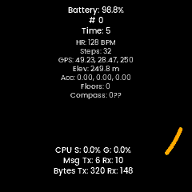

# UNA Watch SDK — Linux Simulator Fork

This branch (`linux-simulator`) patches the UNA Watch SDK to build and run the GCC-based simulator on Linux x86-64.

| HelloWorld tutorial | Sensors tutorial |
|---|---|
|  |  |

For general project documentation — overview, architecture, tutorials, and Windows build instructions — see the **[canonical upstream README](https://github.com/UNAWatch/una-sdk/blob/main/README.md)**.

---

## Linux Quick Start

Full details, patch descriptions, and known limitations are in **[Docs/Simulator-Linux.md](Docs/Simulator-Linux.md)**. The short version:

### 1. Install dependencies

```bash
# Debian / Ubuntu
sudo apt install build-essential ruby libsdl2-dev libsdl2-image-dev

# Arch Linux
sudo pacman -S base-devel ruby sdl2 sdl2_image
```

```bash
gem install nokogiri roo rubyXL json erb
```

### 2. Set the environment variable

```bash
export UNA_SDK=/path/to/una-sdk
```

### 3. Create `config/gcc/app.mk` (one-time, per app)

```bash
cd $UNA_SDK/Docs/Tutorials/HelloWorld/Software/Apps/TouchGFX-GUI
mkdir -p config/gcc
echo 'touchgfx_path := ../../../../../../ThirdParty/touchgfx' > config/gcc/app.mk
```

### 4. Build and run

```bash
cd $UNA_SDK/Docs/Tutorials/HelloWorld/Software/Apps/TouchGFX-GUI
make -f simulator/gcc/Makefile
./build/bin/simulator.out
```

---

## Starting from upstream?

If you are working from the upstream repository rather than this branch, see the [Applying patches to upstream](Docs/Simulator-Linux.md#applying-patches-to-upstream) section of the Linux guide.
